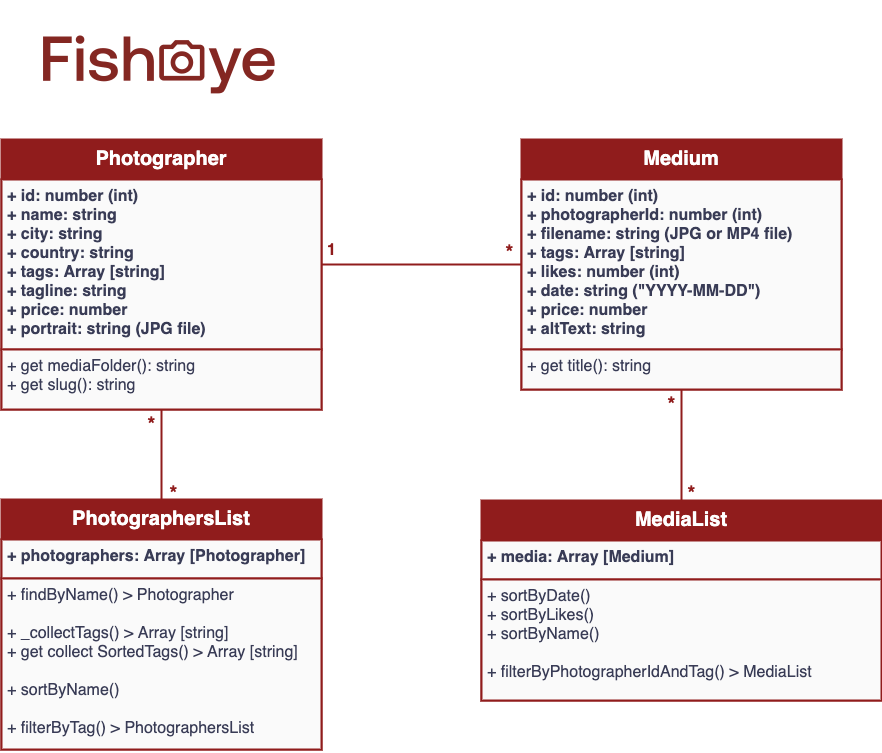

# FishEye - Jan 2021

Code source du **Projet 6** - **_Créez un site accessible pour une plateforme de photographes_** du parcours **Développeur Front-end** d'_OpenClassrooms_.

## Page de démonstration

Le rendu de ce code est accessible sur cette [GitHub Page dédiée](https://logic-fabric.github.io/LoicMangin_6_29012021/).

## Structure du projet

Ce projet a été conçu selon une **approche Orientée Objet**, approche caractérisée par un découpage en classes.

### Données JSON

Pour **manipuler les données**, celles-ci sont représentées par des objets `Photographer`et `Medium` regroupés ensuite dans des objets `PhotographersList`et `MediaList`.

