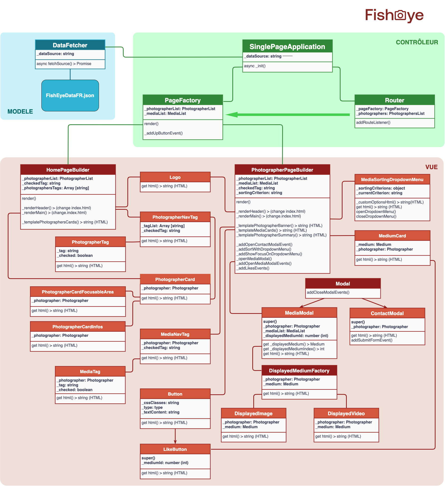

# FishEye - Jan 2021

Code source du **Projet 6** - **_Créez un site accessible pour une plateforme de photographes_** du parcours **Développeur Front-end** d'_OpenClassrooms_.

## Page de démonstration

Le rendu de ce code est accessible sur cette [GitHub Page dédiée](https://logic-fabric.github.io/LoicMangin_6_29012021/).

## Maquette de l'UI

L'UI de ce projet a été réalisée à partir d'une [maquette Figma](https://www.figma.com/file/pt8xJxC1QffW4HX16QhGZJ/UI-Design-FishEye-FR).

## Structure du projet

Ce projet a été conçu selon une **approche Orientée Objet**, approche caractérisée par un découpage en classes.

### Données JSON

- Pour **manipuler les données**, celles-ci sont représentées par des objets `Photographer`et `Medium`, regroupés ensuite dans des `PhotographersList`et `MediaList`.
- Le projet dispose ainsi d'instances d'`Object`et de `Array` "spécialisées", auxquelles associer les **méthodes concernant ces données** :
  - pour les ordonner par nom, date, ...
  - pour les filtrer (en fonction d'un `id`, d'un `tag`, ...)
  - pour ajouter par exemple une propriété `title` à chaque `Medium` (à partir du fichier lui étant associé)
  - etc.

### Architecture

- Une classe `DataFetcher`permet de **récupérer, de manière asynchrone, les données du JSON**, d'en faire des instances de `Photographer` et `Medium` renvoyées sous la forme d'une `PhotographerList`et  d'une `MediaList`.
- Une classe `Router` **"écoute" la route actuelle**, définie par le *hash* de l'URL, et **"actionne" la reconstruction de la page** à chaque changement de ce *hash*.
- La demande de (re)construction est envoyée à une classe `Pagefactory`qui **détermine s'il s'agit de construire une "page accueil" ou une "page photographe"**.

Une instance de ces trois classes est créé par une **`SinglePageApplication`** qui lance également la construction de la page d'accueil initiale.

Ce sont ensuite les actions de l'utilisateur qui redéfinissent le *hash* lu par le `Router`, celui-ci sollicitant la reconstruction de la page auprès de `PageFactory`.

- Deux "classes atelier" `HomePageBuilder`et`PhotographerPageBuilder`se chargent de **construire le HTML** de chaque type de page, de **l'injecter dans `index.html`** et d'y **ajouter les `EventListeners`** nécessaires.
- Ces deux classes ateliers utilisent de leur côté des "classes composants" (`Button`, `PhotographerCard, `...)  chargées chacune de construire le **HTML des composants UI** nécessaires.

